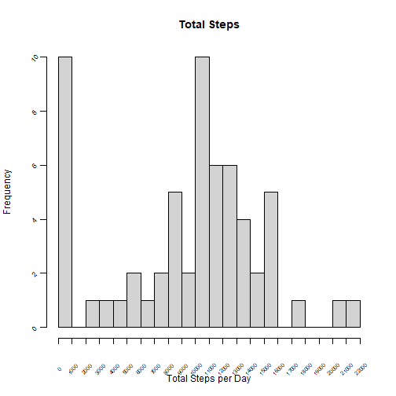
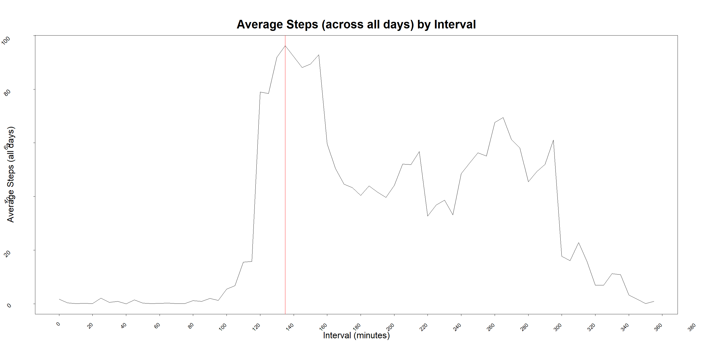
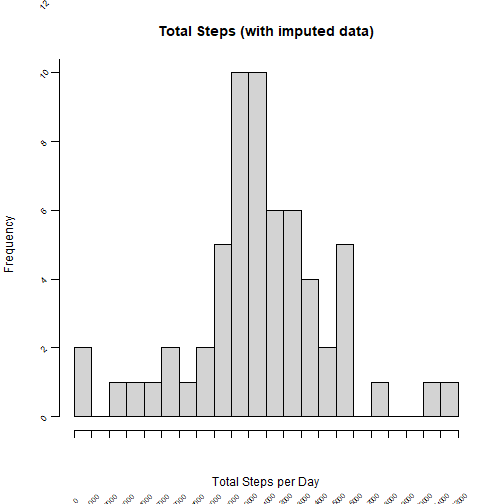
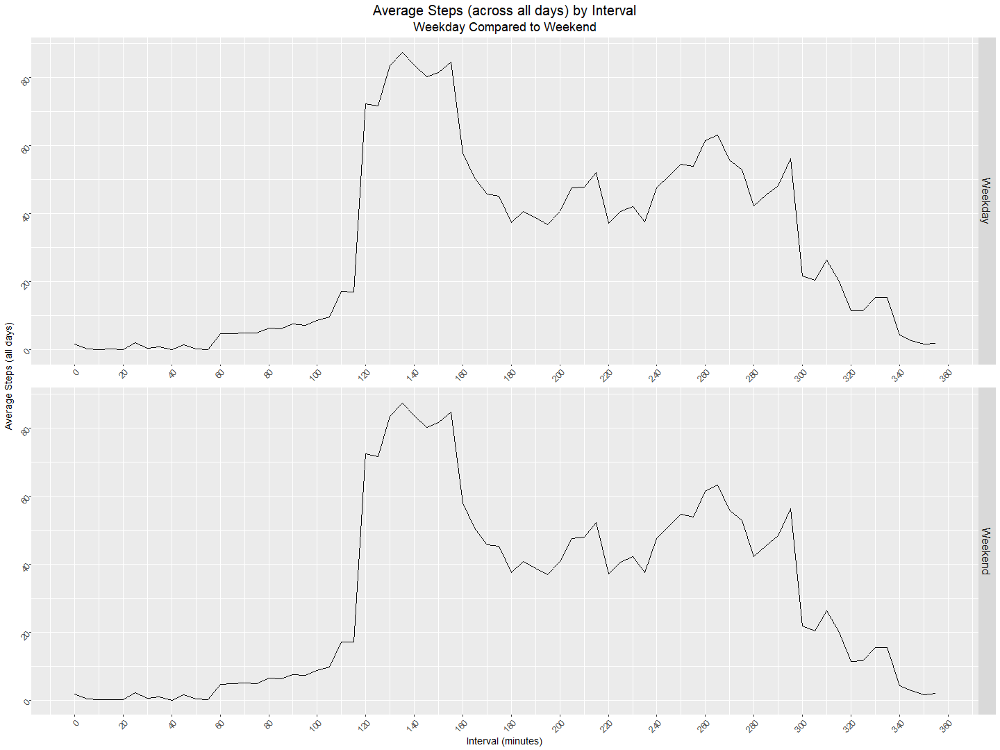

title: "ReproducibleResearch_CourseProject1"
author: "Author: sagiff"
date: "2025-09-18"
output: html_document
---


[Assignment Description:]{.underline} This assignment makes use of data from a personal activity monitoring device. This device collects data at 5 minute intervals through out the day. The data consists of two months of data from an anonymous individual collected during the months of October and November, 2012 and include the number of steps taken in 5 minute intervals each day.

------------------------------------------------------------------------

#### [**Loading and pre-processing the data:**]{.underline}

Load necessary libraries


``` r
  library(dplyr)
  library(ggplot2)
```

File existence check


``` r
  if(!file.exists("activity.csv")) {
    stop(paste("File does not exist:", "activity.csv"))
  }
```

```
## Error: File does not exist: activity.csv
```

Read CSV


``` r
  activity <- read.csv("activity.csv")
```

```
## Warning in file(file, "rt"): cannot open file 'activity.csv': No such file or directory
```

```
## Error in file(file, "rt"): cannot open the connection
```

Convert dates to class 'Date'


``` r
  activity$date <- as.Date(activity$date, format = "%Y-%m-%d")
```

Convert interval time strings to total minutes


``` r
  convert_to_minutes <- function(x) {
    if (nchar(x) > 2) {
      hours <- as.numeric(substr(x, 1, nchar(x) - 2))   ##Get hours - all digits up to the second-to-last
      minutes <- as.numeric(substr(x, nchar(x) - 1, nchar(x)))    ##Get minutes - all digits from second-to-last and beyond
    } else {
      hours <- 0
      minutes <- as.numeric(x)
    }
    
    total_minutes <- (hours * 60) + minutes   ##Calculate total minutes
    return(total_minutes)
  }

  activity$interval <- sapply(activity$interval, convert_to_minutes)
```

------------------------------------------------------------------------

#### [**What is the mean total number of steps taken per day?**]{.underline}

Summarize the data by date (calculate total steps per day, mean steps per day, and median steps per day)


``` r
  activity_summary <- activity %>% group_by(date) %>% summarise(steps_total = as.numeric(sum(steps, na.rm = TRUE)), steps_mean = mean(steps, na.rm = TRUE), steps_median = median(steps, na.rm = TRUE))
```

Convert to data frame


``` r
  activity_summary <- as.data.frame(activity_summary)
```

Report mean and median steps per day


``` r
  print(activity_summary[, c(1, 3, 4)])
```

```
##          date steps_mean steps_median
## 1  2012-10-01        NaN           NA
## 2  2012-10-02  0.4375000            0
## 3  2012-10-03 39.4166667            0
## 4  2012-10-04 42.0694444            0
## 5  2012-10-05 46.1597222            0
## 6  2012-10-06 53.5416667            0
## 7  2012-10-07 38.2465278            0
## 8  2012-10-08        NaN           NA
## 9  2012-10-09 44.4826389            0
## 10 2012-10-10 34.3750000            0
## 11 2012-10-11 35.7777778            0
## 12 2012-10-12 60.3541667            0
## 13 2012-10-13 43.1458333            0
## 14 2012-10-14 52.4236111            0
## 15 2012-10-15 35.2048611            0
## 16 2012-10-16 52.3750000            0
## 17 2012-10-17 46.7083333            0
## 18 2012-10-18 34.9166667            0
## 19 2012-10-19 41.0729167            0
## 20 2012-10-20 36.0937500            0
## 21 2012-10-21 30.6284722            0
## 22 2012-10-22 46.7361111            0
## 23 2012-10-23 30.9652778            0
## 24 2012-10-24 29.0104167            0
## 25 2012-10-25  8.6527778            0
## 26 2012-10-26 23.5347222            0
## 27 2012-10-27 35.1354167            0
## 28 2012-10-28 39.7847222            0
## 29 2012-10-29 17.4236111            0
## 30 2012-10-30 34.0937500            0
## 31 2012-10-31 53.5208333            0
## 32 2012-11-01        NaN           NA
## 33 2012-11-02 36.8055556            0
## 34 2012-11-03 36.7048611            0
## 35 2012-11-04        NaN           NA
## 36 2012-11-05 36.2465278            0
## 37 2012-11-06 28.9375000            0
## 38 2012-11-07 44.7326389            0
## 39 2012-11-08 11.1770833            0
## 40 2012-11-09        NaN           NA
## 41 2012-11-10        NaN           NA
## 42 2012-11-11 43.7777778            0
## 43 2012-11-12 37.3784722            0
## 44 2012-11-13 25.4722222            0
## 45 2012-11-14        NaN           NA
## 46 2012-11-15  0.1423611            0
## 47 2012-11-16 18.8923611            0
## 48 2012-11-17 49.7881944            0
## 49 2012-11-18 52.4652778            0
## 50 2012-11-19 30.6979167            0
## 51 2012-11-20 15.5277778            0
## 52 2012-11-21 44.3993056            0
## 53 2012-11-22 70.9270833            0
## 54 2012-11-23 73.5902778            0
## 55 2012-11-24 50.2708333            0
## 56 2012-11-25 41.0902778            0
## 57 2012-11-26 38.7569444            0
## 58 2012-11-27 47.3819444            0
## 59 2012-11-28 35.3576389            0
## 60 2012-11-29 24.4687500            0
## 61 2012-11-30        NaN           NA
```

Plot a histogram of total number of steps taken each day


``` r
  with(activity_summary, hist(steps_total, breaks = 19, main = "Total Steps", xlab = "Total Steps per Day", ylab = "Frequency", xaxt = "n", yaxt = "n"))
  axis(2, at = seq(0, 10, by = 2), labels = FALSE)
  text(x = par("usr")[1] - 1000, y = seq(0, 10, by = 2), labels = seq(0, 10, by = 2), cex = 0.75, srt = 45, xpd = TRUE)
  axis(1, at = seq(0, 22000, by = 1000), labels = FALSE)
  text(x = seq(0, 22000, by = 1000), y = par("usr")[3] - 1.1, labels = seq(0, 22000, by = 1000), cex = 0.6, srt = 45, xpd = TRUE)
```



------------------------------------------------------------------------

#### [**What is the average daily activity pattern?**]{.underline}

Summarize the data by 5-minute interval (calculate average number of steps across all days)


``` r
  activity_summary2 <- activity %>% group_by(interval) %>% summarise(steps_mean = mean(steps, na.rm = TRUE))
```

Convert to data frame


``` r
  activity_summary2 <- as.data.frame(activity_summary2)
```

Plot a time series plot of average steps taken across all days (y-axis) by interval (x-axis)


``` r
  par(mar = c(5, 4, 4, 2) + 6)
  with(activity_summary2, plot(interval, steps_mean, type = "l", xaxt = "n", yaxt = "n", main = "", xlab = "", ylab = "")) 
  title(main = "Average Steps (across all days) by Interval", line = 2, cex.main = 4)
  title(xlab = "Interval (minutes)", ylab = "Average Steps (all days)", line = 6, cex.lab = 3)
  axis(2, at = seq(0, 200, by = 20), labels = FALSE)
  text(x = par("usr")[1] - 15, y = seq(0, 200, by = 20), labels = seq(0, 200, by = 20), cex = 2, srt = 45, adj = 1.25, xpd = TRUE)
  axis(1, at = seq(0, 1440, by = 20), labels = FALSE)
  text(x = seq(0, 1440, by = 20), y = par("usr")[3] - 3, labels = seq(0, 1440, by = 20), cex = 1.75, srt = 45, adj = 1.25, xpd = TRUE)
  abline(v = activity_summary2$interval[which.max(activity_summary2$steps_mean)], col = "red")
  text(x = 630, y = 207, label = "Max Average = 206, Interval = 835", col = "black", cex = 2)
```



The 5-minute interval that contains the maximum number of steps across all days in the data set is at 835 minutes (at about 13:54)

------------------------------------------------------------------------

#### [**Imputing missing values**]{.underline}

Calculate the total number of missing values in the data set


``` r
  missing_rows <- activity %>% group_by(date) %>% summarise(missing_count = sum(is.na(steps)))
  result <- missing_rows[missing_rows$missing_count == 288, ]
  sum(result$missing_count)
```

```
## [1] 2304
```

Determine which days contain NA values


``` r
  print(result)
```

```
## # A tibble: 8 × 2
##   date       missing_count
##   <date>             <int>
## 1 2012-10-01           288
## 2 2012-10-08           288
## 3 2012-11-01           288
## 4 2012-11-04           288
## 5 2012-11-09           288
## 6 2012-11-10           288
## 7 2012-11-14           288
## 8 2012-11-30           288
```

Use steps_mean (mean steps by interval) to impute missing data


``` r
  activity$steps_imputed <- replace(activity$steps, is.na(activity$steps), activity_summary2$steps_mean)
```

Summarize the data by date (calculate total steps per day, mean steps per day, and median steps per day)


``` r
  activity_summary3 <- activity %>% group_by(date) %>% summarise(steps_total = as.numeric(sum(steps_imputed, na.rm = TRUE)), steps_mean = mean(steps_imputed, na.rm = TRUE), steps_median = median(steps_imputed, na.rm = TRUE))
```

Convert to data frame


``` r
  activity_summary3 <- as.data.frame(activity_summary3)
```

Report mean and median steps per day


``` r
  print(activity_summary3[, c(1, 3, 4)])
```

```
##          date steps_mean steps_median
## 1  2012-10-01 31.4789645     27.80283
## 2  2012-10-02  0.4375000      0.00000
## 3  2012-10-03 39.4166667      0.00000
## 4  2012-10-04 42.0694444      0.00000
## 5  2012-10-05 46.1597222      0.00000
## 6  2012-10-06 53.5416667      0.00000
## 7  2012-10-07 38.2465278      0.00000
## 8  2012-10-08 31.4789645     27.80283
## 9  2012-10-09 44.4826389      0.00000
## 10 2012-10-10 34.3750000      0.00000
## 11 2012-10-11 35.7777778      0.00000
## 12 2012-10-12 60.3541667      0.00000
## 13 2012-10-13 43.1458333      0.00000
## 14 2012-10-14 52.4236111      0.00000
## 15 2012-10-15 35.2048611      0.00000
## 16 2012-10-16 52.3750000      0.00000
## 17 2012-10-17 46.7083333      0.00000
## 18 2012-10-18 34.9166667      0.00000
## 19 2012-10-19 41.0729167      0.00000
## 20 2012-10-20 36.0937500      0.00000
## 21 2012-10-21 30.6284722      0.00000
## 22 2012-10-22 46.7361111      0.00000
## 23 2012-10-23 30.9652778      0.00000
## 24 2012-10-24 29.0104167      0.00000
## 25 2012-10-25  8.6527778      0.00000
## 26 2012-10-26 23.5347222      0.00000
## 27 2012-10-27 35.1354167      0.00000
## 28 2012-10-28 39.7847222      0.00000
## 29 2012-10-29 17.4236111      0.00000
## 30 2012-10-30 34.0937500      0.00000
## 31 2012-10-31 53.5208333      0.00000
## 32 2012-11-01 31.4789645     27.80283
## 33 2012-11-02 36.8055556      0.00000
## 34 2012-11-03 36.7048611      0.00000
## 35 2012-11-04 31.4789645     27.80283
## 36 2012-11-05 36.2465278      0.00000
## 37 2012-11-06 28.9375000      0.00000
## 38 2012-11-07 44.7326389      0.00000
## 39 2012-11-08 11.1770833      0.00000
## 40 2012-11-09 31.4789645     27.80283
## 41 2012-11-10 31.4789645     27.80283
## 42 2012-11-11 43.7777778      0.00000
## 43 2012-11-12 37.3784722      0.00000
## 44 2012-11-13 25.4722222      0.00000
## 45 2012-11-14 31.4789645     27.80283
## 46 2012-11-15  0.1423611      0.00000
## 47 2012-11-16 18.8923611      0.00000
## 48 2012-11-17 49.7881944      0.00000
## 49 2012-11-18 52.4652778      0.00000
## 50 2012-11-19 30.6979167      0.00000
## 51 2012-11-20 15.5277778      0.00000
## 52 2012-11-21 44.3993056      0.00000
## 53 2012-11-22 70.9270833      0.00000
## 54 2012-11-23 73.5902778      0.00000
## 55 2012-11-24 50.2708333      0.00000
## 56 2012-11-25 41.0902778      0.00000
## 57 2012-11-26 38.7569444      0.00000
## 58 2012-11-27 47.3819444      0.00000
## 59 2012-11-28 35.3576389      0.00000
## 60 2012-11-29 24.4687500      0.00000
## 61 2012-11-30 31.4789645     27.80283
```

Plot a histogram of total number of steps taken each day


``` r
  with(activity_summary3, hist(steps_total, breaks = 19, main = "Total Steps (with imputed data)", xlab = "Total Steps per Day", ylab = "Frequency", xaxt = "n", yaxt = "n"))
  axis(2, at = seq(0, 18, by = 2), labels = FALSE)
  text(x = par("usr")[1] - 1000, y = seq(0, 18, by = 2), labels = seq(0, 18, by = 2), cex = 0.75, srt = 45, xpd = TRUE)
  axis(1, at = seq(0, 22000, by = 1000), labels = FALSE)
  text(x = seq(0, 22000, by = 1000), y = par("usr")[3] - 2, labels = seq(0, 22000, by = 1000), cex = 0.6, srt = 45, xpd = TRUE)
```



------------------------------------------------------------------------

#### [**Are there differences in activity patterns between weekdays and weekends?**]{.underline}

Create a new factor variable with two levels - "weekday" and "weekend"


``` r
  activity$day <- weekdays(activity$date)
  activity <- activity %>% mutate(group = factor(ifelse(day %in% c("Monday", "Tuesday", "Wednesday", "Thursday", "Friday"), "Weekday", "Weekend")))
```

Summarize the data by group (calculate total steps per day, mean steps per day)


``` r
  activity_summary4 <- activity %>% group_by(interval) %>% reframe(steps_total = as.numeric(sum(steps_imputed, na.rm = TRUE)), steps_mean = mean(steps_imputed, na.rm = TRUE), group = group)
```

Convert to data frame


``` r
  activity_summary4 <- as.data.frame(activity_summary4)
```

Create a panel plot containing a time series plot of the 5-minute interval (x-axis) and avg. steps across all week/weekend days (y-axis)


``` r
  g <- ggplot(activity_summary4, aes(interval, steps_mean))
  g + geom_line() + facet_grid(rows = vars(group)) + facet_wrap(vars(group), axes = "all", nrow = 2, strip.position = "right") + scale_x_continuous(breaks = seq(0, 1500, by = 20), labels = seq(0, 1500, by = 20)) + theme(axis.text.x = element_text(size = 12, angle = 45, hjust = 1)) + scale_y_continuous(breaks = seq(0, 200, by = 20), labels = seq(0, 200, by = 20)) + theme(axis.text.y = element_text(size = 12, angle = 45, hjust = 1), strip.text = element_text(size = 16)) + labs(title = "Average Steps (across all days) by Interval", subtitle = "Weekday Compared to Weekend", x = "Interval (minutes)", y = "Average Steps (all days)") + theme(plot.title = element_text(size = 20, hjust = 0.5), plot.subtitle = element_text(size = 18, hjust = 0.5), axis.title.x = element_text(size = 14), axis.title.y = element_text(size = 14))
```



